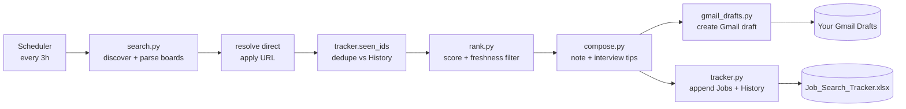

# Jobwright

**An autonomous job-search & application-prep agent for data-engineering roles.**

Jobwright runs on a schedule, discovers fresh entry-level Data / Analytics Engineer
postings across public job boards, scores each one against your resume, writes a
tailored application note and interview-prep sheet, and saves a ready-to-review
**Gmail draft** for every strong match — leaving the final "Send / Apply" click to you.

> Built as a portfolio project to demonstrate agentic automation, a scoring engine,
> ETL-style data collection, a dedupe/history store, and third-party API integration.

---

## Why it exists

Job hunting for entry-level data roles means re-checking a dozen boards every day,
re-reading near-identical listings, and rewriting the same cover note. Jobwright turns
that into a hands-off pipeline: it does the searching, ranking, and drafting; you do the
reviewing and applying.

## What it does

- **Discovers** roles from multiple open Built In boards (national, remote, and Texas metros).
- **Resolves the *direct* apply URL** — the real Greenhouse / Ashby / Lever / Workday / SmartRecruiters
  link behind each posting, so you skip the aggregator middle-step.
- **Filters** to genuinely active listings posted within the last *N* days (default 7).
- **Dedupes** against a persistent history store so you're never notified about the same job twice.
- **Ranks** each role 0–100 on a weighted blend of skills overlap, location preference,
  recency, and salary signal, then labels priority High / Medium / Low.
- **Composes** a personalized application note, "why I match", skill-gap list, and interview tips.
- **Drafts** a review email per job in Gmail (via the Gmail API — it never sends).
- **Persists** everything to an Excel tracker (`Jobs` + `History` sheets).

## Architecture



## Tech stack

| Layer | Tools |
|-------|-------|
| Language | Python 3.10+ |
| Data collection | `requests`, `BeautifulSoup` |
| Scoring | pure-Python weighted model (`rank.py`) |
| Storage / dedupe | `openpyxl` Excel tracker (`Jobs` + `History`) |
| Email | Gmail API (`google-api-python-client`, OAuth) |
| Scheduling | `APScheduler` (or system `cron`) |
| Config | `python-dotenv` |

## Project layout

```
jobwright/
├── run.py                 # CLI entry point (--dry-run, --serve)
├── config.py              # profile, targets, source boards, scoring weights
├── requirements.txt
├── .env.example
└── jobwright/
    ├── models.py          # Job dataclass + stable job_id for dedupe
    ├── search.py          # fetch/parse boards, resolve direct apply URLs
    ├── rank.py            # scoring + freshness/entry-level filtering
    ├── compose.py         # application note, interview tips, email body
    ├── tracker.py         # Excel tracker + dedupe/history layer
    ├── gmail_drafts.py    # Gmail API draft creation (never sends)
    └── pipeline.py        # orchestrates one end-to-end run
```

## Setup

```bash
git clone https://github.com/<you>/jobwright.git
cd jobwright
python -m venv .venv && source .venv/bin/activate
pip install -r requirements.txt
cp .env.example .env          # then edit values
```

**Gmail API:** create a Google Cloud project, enable the Gmail API, download the OAuth
client secret as `credentials.json`, and set `GMAIL_CREDENTIALS_PATH` in `.env`. The first
run opens a browser for consent and caches `token.json`.

Edit your profile, target roles, and skill list in `config.py`.

## Usage

```bash
python run.py --dry-run     # discover + rank + print, write nothing
python run.py               # full run: creates Gmail drafts + updates the tracker
python run.py --serve       # run now, then every 3 hours
```

Or schedule with cron (every 3 hours):

```cron
0 */3 * * * cd /path/to/jobwright && /path/to/.venv/bin/python run.py >> jobwright.log 2>&1
```

## Scoring model

`match_score = 0.60·skills + 0.15·location + 0.15·recency + 0.10·salary` (weights in `config.py`).
`skills` is the overlap between a listing's required skills and your `core_skills`;
`recency` decays with posting age; `location` boosts preferred/remote roles;
`salary` rewards listings that publish a range. Priority is High ≥ 80, Medium ≥ 65, else Low.

## Design notes & honesty

- Jobwright leans on **openly accessible boards and public ATS links**. It does not scrape
  login-gated sites or bypass anti-bot protections.
- It **never sends email or submits applications** — humans stay in the loop by design.
- The dedupe store is a simple Excel sheet for portability; swapping in SQLite is a one-file change in `tracker.py`.

## Roadmap

- SQLite backend option and a small Streamlit dashboard over the tracker.
- Pluggable source adapters (Greenhouse/Lever board APIs directly).
- Embeddings-based semantic skill matching to complement keyword overlap.

## License

MIT © Vishnu Vardhan Mutha
